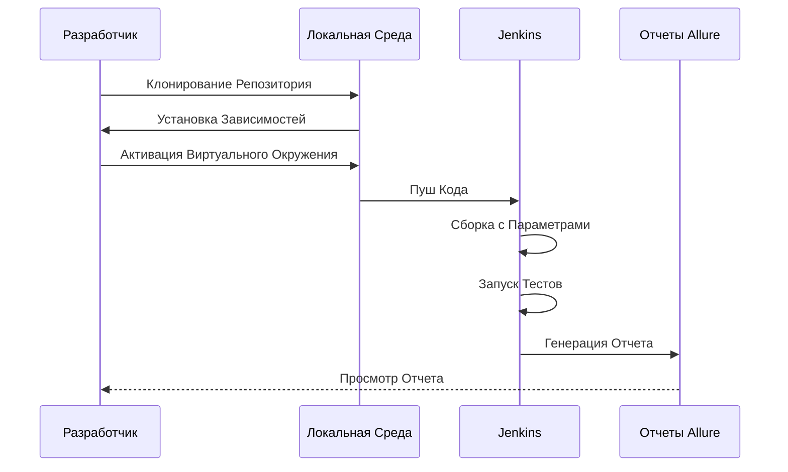

# Проект автоматизированного тестирования сайта компании СТД Петрович

[](https://petrovich.ru/)

---

Этот проект содержит автоматизированные тесты для веб-сайта [Петрович](https://petrovich.ru/).

## Описание

Проект включает набор автоматизированных тестов, написанных с использованием фреймворков Selene, Allure, Pytest, Appium
и Postman. Тесты проверяют основные функциональные возможности сайта, такие как:

- **Авторизация пользователей**: Проверка процесса входа в систему для веб-версии и мобильных приложений.
- **Поиск товаров**: Тестирование поисковой функции для корректного нахождения товаров.
- **Добавление товаров в корзину**: Проверка работы корзины покупок, включая добавление и удаление товаров.
- **Навигация по каталогу**: Тестирование удобства использования каталога товаров.

Тестирование осуществляется как для веб-версии, так и для мобильных приложений (Android) с использованием **Appium
** для автоматизации мобильных тестов. Для API-тестирования используется **Postman**, что позволяет проверять
корректность работы серверных эндпоинтов.

Процесс интеграции включает использование **Jenkins** для автоматизации сборки и запуска тестов. Результаты тестирования
собираются и формируются в виде красочных отчетов с помощью **Allure** и **Allure TestOps**, что обеспечивает детальный
анализ покрытия тестами и эффективное управление тестовым процессом.

После завершения тестирования, результаты автоматически отправляются в **Telegram** для оперативного уведомления команды
о статусе выполнения тестов и выявленных проблемах.

---

## Используемые инструменты

<p align="center">
  
  
  
  
  
  
  
  
  
  

</p>

| Инструмент         | Описание                                                                                                                   |
|--------------------|----------------------------------------------------------------------------------------------------------------------------|
| **Selene**         | Обертка над Selenium, облегчающая написание тестов и взаимодействие с веб‑элементами.                                      |
| **Allure**         | Инструмент для создания отчетов о тестировании с поддержкой различных языков.                                              |
| **Allure TestOps** | Расширенная система управления тестированием, интегрируемая с CI/CD и Jira для мониторинга покрытия тестами и аналитики.   |
| **Jira**           | Система управления задачами, используемая для отслеживания дефектов и планирования тестирования.                           |
| **Pytest**         | Фреймворк для написания и запуска тестов. Он предоставляет удобный синтаксис и разнообразные возможности для тестирования. |
| **Appium**         | Инструмент для автоматизации мобильных приложений, позволяет тестировать приложения на Android и iOS.                      |
| **Browserstack**   | Облачный сервис для запуска тестов на реальных устройствах и браузерах.                                                    |
| **Postman**        | Инструмент для тестирования API, позволяющий создавать коллекции запросов и проводить автоматизацию API-тестов.            |

---

## Содержание

<details>
<summary>Установка</summary>

### Клонирование репозитория

Для начала работы, клонируйте репозиторий и перейдите в директорию проекта:

   ```sh
    git clone https://github.com/yarskii/petrovich.git
    cd cft_tests
   ```

### Создание виртуального окружения (опционально)

   ```sh
    python -m venv venv
    source venv/bin/activate  # Для Linux/macOS
    .\venv\Scripts\activate   # Для Windows
   ```

### Установка зависимостей

Создайте файл `requirements.txt`, содержащий список всех зависимостей проекта:

   ```sh
    pip freeze > requirements.txt
   ```

Затем установите зависимости:

   ```sh
    pip install -r requirements.txt
   ```

Если у вас уже есть файл `requirements.txt`, просто выполните команду:

   ```sh
    pip install -r requirements.txt
   ```

</details>

<details>
<summary>Запуск тестов</summary>

### Локальный запуск

Чтобы запустить все тесты, выполните команду:

   ```sh
    pytest
   ```

Для запуска конкретного теста, используйте следующую команду:

   ```sh
    pytest tests/ui/authentication/test_successful_login_ui.py
   ```

### Параметры запуска

Вы можете использовать различные параметры для управления поведением тестов:

- `-s`: Выводить все выводы в консоль.
- `-v`: Детализированное логирование.
- `--alluredir=allure-results`: Сохранять результаты тестов для генерации отчетов Allure.

Пример команды:

   ```sh
    pytest --alluredir=allure-results
   ```

</details>


<details>
<summary>Генерация отчетов Allure</summary>

### Установка Allure Commandline

Следуйте инструкциям на официальном сайте [Allure](https://docs.qameta.io/allure/#_installing_a_commandline) для
установки Allure Commandline.

### Генерация отчета

После выполнения тестов с параметром `--alluredir`, вы можете сгенерировать отчет следующей командой:

   ```sh
    allure serve allure-results
   ```

### Общий отчёт Allure


Здесь представлен общий отчет Allure, который содержит сводную информацию о результатах выполнения тестов: количество
пройденных, упавших и пропущенных тестов.

---

### Детальный отчёт о пройденном тесте


На этом скриншоте показан детальный отчет о конкретном тесте, включая шаги выполнения, логи и прикрепленные скриншоты.


</details>

<details>
<summary>Запуск проекта в Jenkins</summary>

1. Откройте [проект](https://jenkins.autotests.cloud/job/petrovich/)
2. Выберите `Build with parameters`
3. Измените параметры, если требуется:
    - Укажите комментарий
    - Выберите вариант теста
    - Выберите версию браузера
    - Выберите мобильное окружение (для мобильных тестов)
4. Нажмите `Build`
5. После сборки, результат работы можно увидеть в `Allure Report`

> **Доступные параметры**:
> - Варианты тестов: `tests`, `tests/api`, `tests/mobile`, `tests/ui`...
> - Версия браузера: `99`, `100`, `113`, `114`, `120`, `121`, `122`, `123`, `124`, `125`, `126`

### Cтраница тестов Jenkins


Этот скриншот демонстрирует интерфейс Jenkins, где можно запускать тесты с различными параметрами и просматривать их
статус.

---
</details>

<details>
<summary>Интеграция с Jira</summary>

В проекте используется система управления задачами **Jira** для отслеживания дефектов, планирования тестирования и
координации работы между командами разработки и тестирования.

### Как это работает:

- **Регистрация дефектов**: Все выявленные проблемы во время автоматизированного тестирования автоматически или вручную
  регистрируются как задачи в Jira.
- **Связь с тест-кейсами**: Каждый тестовый сценарий может быть связан с задачей в Jira, что позволяет легко отслеживать
  статус тестирования конкретной функциональности.
- **Отчетность**: Интеграция с Allure TestOps обеспечивает возможность генерации отчетов, которые включают ссылки на
  задачи Jira, связанные с тестами.


Эта интеграция помогает командам эффективно управлять процессом тестирования, быстро реагировать на выявленные проблемы
и поддерживать высокое качество продукта.

---
</details>

<details>
<summary>Диаграмма</summary>

### Последовательность действий при запуске тестов



</details>

<details>
<summary>Скриншоты</summary>


---


---

### Интеграция с Allure TestOps


Эти изображения демонстрируют интеграцию проекта с Allure TestOps для управления тестами, анализа покрытия и мониторинга
результатов.

---

### Интеграция с Jira


Скриншот показывает, как дефекты и задачи, выявленные в ходе тестирования, регистрируются и отслеживаются в системе
Jira.

---

### Видео-отчет о прохождении теста UI


Демонстрация видео-отчета о выполнении UI-тестов. Это помогает наглядно увидеть процесс тестирования и возможные
проблемы.

---

### Видео-отчет о прохождении мобильного теста


Видеозапись выполнения мобильных тестов, включая авторизацию и другие ключевые действия на мобильном устройстве.

---

### Отчет в Telegram

   <p align="center">
      
   </p>

Пример автоматического уведомления в Telegram о результате выполнения тестов. Это позволяет оперативно реагировать на
любые проблемы.
</details>

---

## Лицензия

Этот проект лицензирован под MIT License. Подробности смотрите в файле [LICENSE](LICENSE).

---

Если у вас есть вопросы или предложения, пожалуйста, создайте issue на GitHub или свяжитесь со мной напрямую.

Автор: Ярослав Гусев
