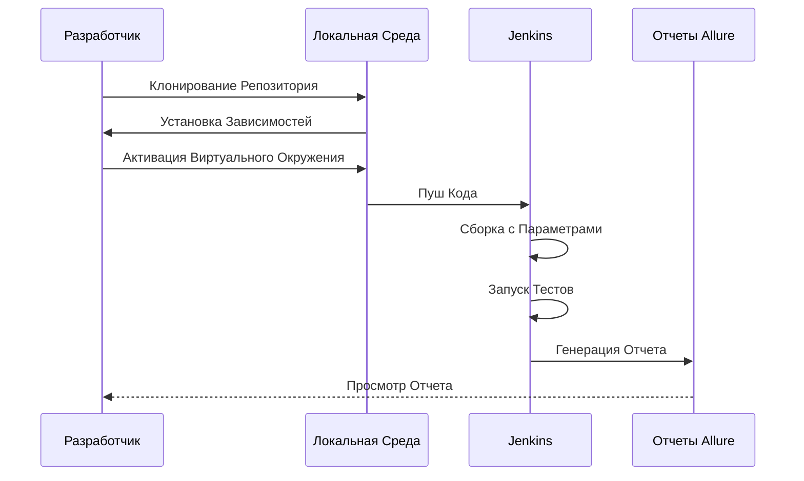

# Проект Web/Mobile тестирования сайта компании СТД Петрович

   <p align="center">
      
   </p>

---

Этот проект содержит автоматизированные тесты для веб-сайта [Петрович](https://petrovich.ru/).

## Описание

Проект включает набор автоматизированных тестов, написанных с использованием фреймворков Selene, Allure и Pytest. Тесты
проверяют основные функциональные возможности сайта, такие как авторизация, поиск товаров, добавление товаров в корзину
и навигация по каталогу.

---

## Используемые инструменты

[//]: # (<p align="center">)

[//]: # (  )

[//]: # (  )

[//]: # (  )

[//]: # (  )

[//]: # (  )

[//]: # (  )

[//]: # (  )

[//]: # (  )

[//]: # (  )

[//]: # (  )

[//]: # (  )

[//]: # (  )

[//]: # (  )

[//]: # (</p>)

<p align="center">
  
  
  
  
  
  
  
  
  
  
  
  
  
</p>


| Инструмент       | Описание                                                                                                                   |
|------------------|----------------------------------------------------------------------------------------------------------------------------|
| **Selene**       | Обертка над Selenium, облегчающая написание тестов и взаимодействие с веб‑элементами.                                      |
| **Allure**       | Инструмент для создания красочных отчетов о тестировании с поддержкой различных языков.                                    |
| **Pytest**       | Фреймворк для написания и запуска тестов. Он предоставляет удобный синтаксис и разнообразные возможности для тестирования. |
| **Appium**       | Инструмент для автоматизации мобильных приложений, позволяет тестировать приложения на Android и iOS.                      |
| **Browserstack** | Облачный сервис для запуска тестов на реальных устройствах и браузерах.                                                    |

---

## Содержание

<details>
<summary>Установка</summary>

### Клонирование репозитория

Для начала работы, клонируйте репозиторий и перейдите в директорию проекта:

   ```sh
    git clone https://github.com/yarskii/petrovich.git
    cd cft_tests
   ```

### Создание виртуального окружения (опционально)

   ```sh
    python -m venv venv
    source venv/bin/activate  # Для Linux/macOS
    .\venv\Scripts\activate   # Для Windows
   ```

### Установка зависимостей

Создайте файл `requirements.txt`, содержащий список всех зависимостей проекта:

   ```sh
    pip freeze > requirements.txt
   ```

Затем установите зависимости:

   ```sh
    pip install -r requirements.txt
   ```

Если у вас уже есть файл `requirements.txt`, просто выполните команду:

   ```sh
    pip install -r requirements.txt
   ```

</details>

<details>
<summary>Запуск тестов</summary>

### Локальный запуск

Чтобы запустить все тесты, выполните команду:

   ```sh
    pytest
   ```

Для запуска конкретного теста, используйте следующую команду:

   ```sh
    pytest tests/ui/authentication/test_successful_login_ui.py
   ```

### Параметры запуска

Вы можете использовать различные параметры для управления поведением тестов:

- `-s`: Выводить все выводы в консоль.
- `-v`: Детализированное логирование.
- `--alluredir=allure-results`: Сохранять результаты тестов для генерации отчетов Allure.

Пример команды:

   ```sh
    pytest --alluredir=allure-results
   ```

</details>


<details>
<summary>Генерация отчетов Allure</summary>

### Установка Allure Commandline

Следуйте инструкциям на официальном сайте [Allure](https://docs.qameta.io/allure/#_installing_a_commandline) для
установки Allure Commandline.

### Генерация отчета

После выполнения тестов с параметром `--alluredir`, вы можете сгенерировать отчет следующей командой:

   ```sh
    allure serve allure-results
   ```

</details>

<details>
<summary>Запуск проекта в Jenkins</summary>

1. Откройте [проект](https://jenkins.autotests.cloud/job/petrovich/)
2. Выберите `Build with parameters`
3. Измените параметры, если требуется:
    - Укажите комментарий
    - Выберите вариант теста
    - Выберите версию браузера
    - Выберите мобильное окружение (для мобильных тестов)
4. Нажмите `Build`
5. После сборки, результат работы можно увидеть в `Allure Report`

> **Доступные параметры**:
> - Варианты тестов: `tests`, `tests/api`, `tests/mobile`, `tests/ui`...
> - Версия браузера: `99`, `100`, `113`, `114`, `120`, `121`, `122`, `123`, `124`, `125`, `126`
---
</details>

<details>
<summary>Диграмма</summary>

### Последовательность действий при запуске тестов



</details>

<details>
<summary>Скриншоты</summary>

### Cтраница тестов Jenkins

   <p align="center">
      
   </p>

### Общий отчёт Allure

   <p align="center">
      
   </p>

### Детальный отчёт о пройденном тесте

   <p align="center">
      
   </p>

### Видео-отчет о прохождении теста UI

   <p align="center">
      
   </p>

### Видео-отчет о прохождении мобильного теста

   <p align="center">
      
   </p>

### Отчет в Telegram

   <p align="center">
      
   </p>
</details>

---

## Лицензия

Этот проект лицензирован под MIT License. Подробности смотрите в файле [LICENSE](LICENSE).

---

Если у вас есть вопросы или предложения, пожалуйста, создайте issue на GitHub или свяжитесь со мной напрямую.

Автор: Ярослав Гусев
